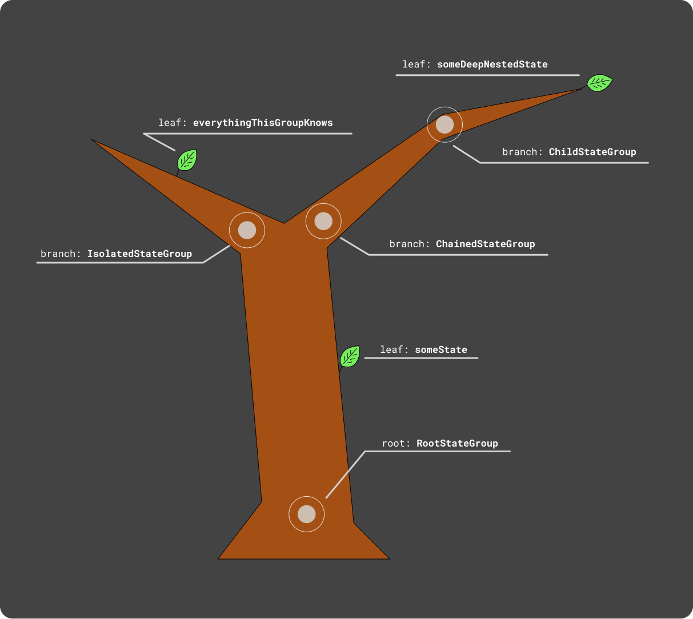

# Treeed. The tree-based state manager for Dart projects.

## Idea.
The idea behind this package is to create a state manager that will be (1) type-safe, (2) fast, (3) easy to setup and to scale, (4) available and reliable for any Dart project that needs state managment, (5) compatible with almost any architecture.

1. **Type safety.**
Type safety for a state manager means that you as a programmer can be sure if a dependency is available or not at any point in your program. Most popular state managers in Dart provide the features that surely give you an easy way to setup your controllers, services and other dependencies, but don't give a 100% guarantee that those dependencies will be available everywhere in your program.
2. **Speed.**
Some state managers store your state dependencies in some sort of key-value containers, which is a pretty fast but not the fastest way to access your data. You can feel that speed lower a lot if you don't cache the data you got from those managers and try to access it very often (for example when you build a list of widgets in flutter and call the state-container finder for every built widget).
3. **Simplicity.**
Almost all architectures already have a solution for managing the state of an app. Mostly, developers use third-party state managers not only to get the feature of having a state in an app, but to have a stable and an easy to use solution that could bring some bright ideas to their code. They don't want to add a new dependency to debug.
4. **Availability for different project types.**
Dart is not a flutter-only language, it can be used with other front-end frameworks and libraries, or even for back-end apps. It's great to have almost identical state-managing logic on both back-end and front-end. And it's also very convenient to be able to carry your knowledge and experience in using a specific state manager across different projects.
5. **Compatibility with architectures.**
State manager should not be a thing that describes an app's architecture. It should be flexible, so it can be used in almost any case and project.

> In total: Treeed must be a state managing package that gives more guarantees about app's state and dependencies; it must be fast enough, so that the developers can focus on business logic; it must provide an easy API that wraps and abstracts the state managing logic that doesn't need to be debugged; and it also must be as simple and common as possible, so any Dart project could use it.

## Docs.

Any state manager needs to be set up and be ready for scaling.

### Setting up.

Just create the type (class) for your state, it will be the root of the state.
```dart
class MyRootState extends TreeedGroup {
    late final isWorksNow = treeedState(false);
    late final amountOfPreccessedRequests = treeedState(0);
}
```

Your state can be split by groups, so you can access any group from root state and subscribe only to changes of the specific state in the group of states.
```dart
class MyRootState extends TreeedGroup {
    late final isWorksNow = treeedState(false);
    late final amountOfPreccessedRequests = treeedState(0);

    final tabs = TabsState();
}

class TabsState extends TreeedGroup {
    final _availableTabs = [
        MyTab(title: 'Tab 1'),
        MyTab(title: 'Tab 2'),
        MyTab(title: 'Tab 3'),
        MyTab(title: 'Tab 4'),
    ];
    List<MyTab> get availableTabs => _availableTabs;

    late final activeTab = treeedState(availableTabs[0]);
}

enum ThemeBrightness { light, dark, system, random }

class ThemeState extends TreeedGroup {
    late final brightness = treeedState(ThemeBrightness.light);
}
```

Some state classes (state groups, aka state controllers) must have an option to access other state controllers. And some of them should be isolated.
```dart
class RootStateGroup extends TreeedGroup {
    late final someState = treeedState(42);

    // If the group is updated then this group will also call the updated event.
    late final chainedGroup = treeedGroup(ChainedStateGroup(parent: this));

    // This isolatedly created object lives its own life, so this group won't know if it will be updated.
    final isolatedGroup = IsolatedStateGroup();
}

class ChainedStateGroup extends TreeedGroup {
    const ChainedStateGroup({requried this.parent});

    final RootStateGroup parent;
    final childGroup = ChildStateGroup(parent: this);
}

class ChildStateGroup extends TreeedGroup {
    const ChildStateGroup({requried this.parent});

    final ChainedStateGroup parent;
    late final someDeepNestedState = treeedState('42');

    TreeedState<int> get someRootState =>
        parent.parent.someState;

    TreeedState<String> get whatIsolatedGroupKnows =>
        parent.parent.isolatedGroup.everythingThisGroupKnows;
}

class IsolatedStateGroup extends TreeedGroup {
    late final everythingThisGroupKnows = treeedState('nothing, actually');
}
```

Now, after the types of the state are created, we need to create the state's instance and populate it to the app. And since Treeed is trying to be architecture-agnostic, there is a bunch of ways to instanciate the state and use it.
1. Global public way.
```dart
final appState = RootStateGroup();

void main() {
    // Use your state anywhere in the program just by accessing `appState`.
}
```

2. The "DI" way.
```dart
void main() {
    final appState = RootStateGroup();
    runMyApp(state: appState); // Use the state only where you allow.
}
```

3. The static singletoned way.
Just make every field of your state types static.
```dart
void main() {
    // Use your state anywhere in the program because it is static.
    RootStateGroup.someState.set(42);
}
```

... And other variations :)

### Using.
Treeed can be used for building state-reactive flutter apps, events based back-end or any other programs that need a state manager, with ease.

There are three basic things you can do with your state: (1) subscribe to the updates, (2) update the state and (3) read it.
1. **Subscriptions.**
With Treeed your state is built only with two basic types: TreeedGroup and TreeedState. And you can subscribe to both of them by using `.listen()` method. And unsubscribing is done by `.unlisten` method.
    a. `.listen` method gets one argument: function that will be called if value changed.
    c. `.unlisten` method gets one argument: function to delete from listeners list, so it will not be called on state changes.
2. **Setting / updating.**
To set a new value inside a `TreeedState` use `.set` method. There is no setter that will allow you update the value by doing `state.value = 'new value'` because overloading operators makes your code less readable and more prone to get bugs. Explicit method `.set` allows you to see that there is not just a casual re-assignment, there is some work being done with your state.
3. **Getting / reading.**
To read a value inside a `TreeedState` use `.get` getter. The field of the value you want to read is hidden by Dart's privacy incapsulation feature to force you to update it only with `.set` method.

Example:
```dart
final appState = RootStateGroup();

void main() {
    final myListeningFunction =
        () => print('Something in the group was updated!');

    // This subscription will live until you execute the `.unlisten` method.
    appState.listen(myListeningFunction);

    // Changing deeply nested state and waiting for the info to print.
    appState
        .chainedGroup
        .childGroup
        .someDeepNestedState
        .set('forty two');

    final myObj = MyListneningObj();

    appState.someState.set(43); // Getting the log printed here from `myObj`.

    myObj.stopWorking();
    
    appState.someState.set(44); // Not getting the logs from `myObj` anymore.

    appState.unlisten(myListeningFunction); // The last listener was deleted here.
}

class MyListneningObj {
    MyListneningObj() {
        appState.someState.listen(_workToBeDone);
    }

    void _workToBeDone(newValue) {
        print('Look! We have got a $newValue!');
    }

    void stopWorking() {
        appState.someState.unlisten(_workToBeDone);
    }
}
```

### Scaling.

Since Treeed is a tree based state manager, the state scaling part of developing your app is made very easy. Simply imagine your state manager as a tree, the state as the tree's root, state groups (aka controllers) as the tree's branches and state value containers as the tree's leafs.

For some visual experience, this is how the `RootStateGroup` defined above can be imagined as a tree:



As you can see this tree has very rare foliage and a small amount of branches. But this is just an example of a small state model.

